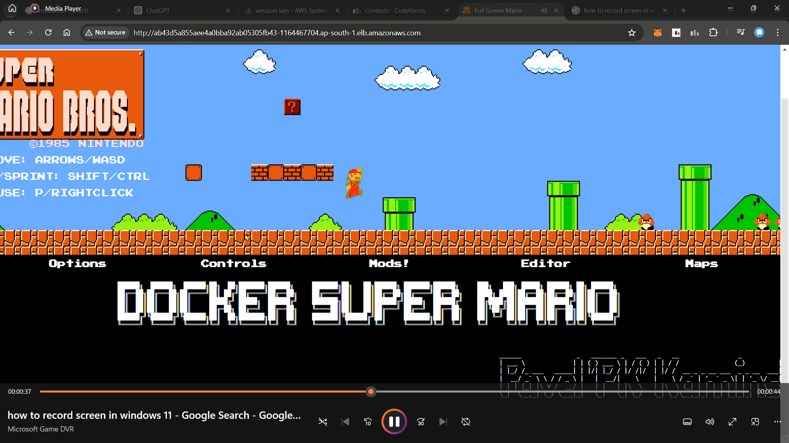

# Mario Game 


[](https://youtu.be/x8eOoki4tww)

## Deploying Mario Docker Image on AWS EK

1. **eksctl-config.yaml**: This file contains the configuration for creating the EKS cluster using eksctl.
2. **deployment.yaml**: This file contains the Kubernetes deployment configuration for deploying the Mario Docker image.
3. **service.yaml**: This file contains the Kubernetes service configuration for exposing the Mario application.

## Step 1: Create the EKS Cluster

Use the `eksctl` tool to create the EKS cluster. Modify the `eksctl-config.yaml` file with your desired configurations and run the following command:

```bash
eksctl create cluster -f eksctl-config.yaml
```

## Step 2: Configure the kubectl

To configure `kubectl`to use the newly created cluster, use the following command:

```bash
aws eks --region ap-south-1 update-kubeconfig --name mario-cluster
```

## Step 3: Deploy the mario Docker Image
Apply the `deployment.yaml` file to deploy the Mario Docker image to the EKS cluster:
```bash
kubectl apply -f deployment.yaml
```

## Step 4: Expose the Mario Service
Apply the `service.yaml` file to expose the Mario service:
```bash
kubectl apply -f service.yaml
```

